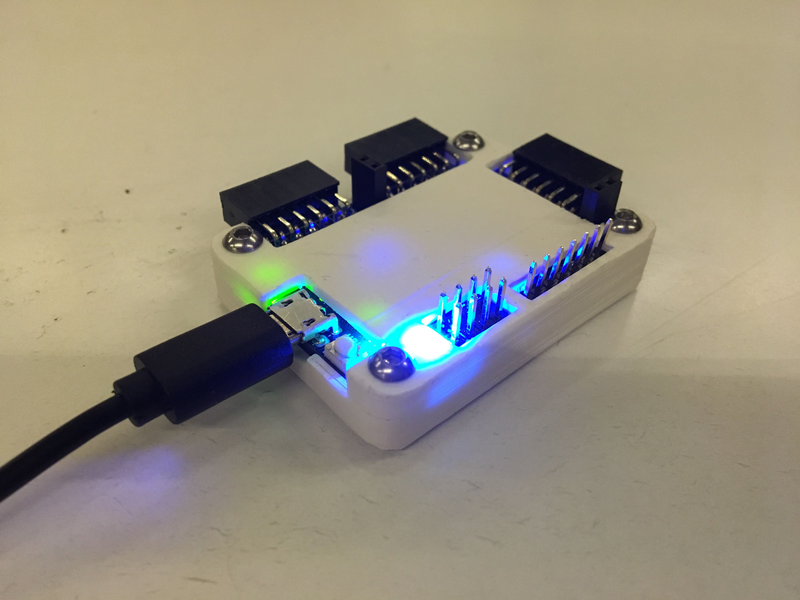

# Icebreaker FPGA Board Case

## Introduction
This is a 3d printable case for the Icebreaker FPGA board version 1.0c as sold here: https://www.crowdsupply.com/1bitsquared/icebreaker-fpga . 

## Assumptions
This case was made for an icebreaker board with the PMOD part removed, a RGB led installed and all headers except CRESET soldered.
The case was modeled in Fusion 360 and archive files plus possible export formats are included. For 3d printing STL files were generated.

If you have already soldered CRESET, there is an untested cover in the Extra folder. If you don't want to remove the PMOD part, you can remove a bit of the edge on the bottom part. This is not reccomended, as it makes it much more likely to snap it off by accident.

## Tools and parts needed
* A well adjusted 3d printer
* White or lightly colored fillament
* 4 M3 nuts
* 4 ISO 7380 button head socket cap screw M3, 10mm long, or equivalent.

## Printing instructions
The board has a rather tight fit into the bottom case, make sure your printer is well calibrated. The outside dimensions of the board are 50x37mm and if the board doesn't fit in the bottom part of the case, you can scale the print in the X-Y plane in your favorite slicing software. Be aware that mousebites on the board increase the dimensions a bit and might need to be filed down. Both parts can be printed without support, although you will have to rotate the top part with 180 degrees in the X axis.

The nuts should be embedded into the print by pressing them into it. Cutting a small chamfer into the bottom edge will help. Another option is to drag them into the print by tightning the bolts.

## Licence and contributions
This case is shared as CC-BY-SA 4.0. This case was tested on an Ultimaker Classic and a icebreaker v1.0c. If it doesn't work on your setup i would be interested to know, as well as the things you tried fixing it. If you like this case and want to contribute something back, please consider helping out in other parts of the openfpga project. 